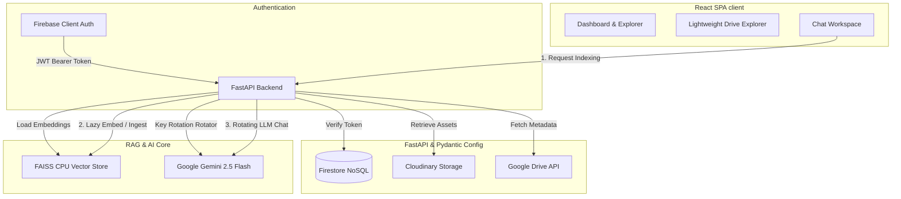

# 🌌 NEXORA: Enterprise-Grade AI Document Intelligence SaaS

> Nexora is a premium MERN/FastAPI Retrieval-Augmented Generation (RAG) SaaS platform. Connect personal Google Drives dynamically, browse metadata-only file structures, lazily index supported documents, and chat with files utilizing round-robin Gemini API key rotation, Firebase Admin security, and Cloudinary storage.

---

## 🧠 System Architecture

Nexora utilizes a highly decoupled, modern service architecture engineered for high speed, low memory utilization, and complete resilience.



---

## ✨ Features

- 📑 **Dynamic Google Drive Integration:** Dynamic, user-specific OAuth 2.0 flow. Browse and search personal Google Drive folders instantly.
- ⚡ **Lightweight Directory Scanning:** High-performance, metadata-only directory scanning traversal. No heavy file downloading or vector ingestion occurs during scanning, preventing SSL socket collisions.
- 💬 **Context-Grounded RAG Chat:** Ask questions in plain English and receive responses grounded in your document snippets with exact inline page citations.
- 🔮 **Lazy Indexing Sidebar Panel:** Document ingestion is isolated to the Chat Sidebar Drive panel. Index documents (`PDF`, `DOCX`, `TXT`) only when you select them to start a conversation.
- 🔑 **Multi-Key Rotating Gemini Core:** Round-robin rotate through up to 5 Google Gemini API keys to balance quota ceilings and avoid `429 Rate Limit` blockages.
- ☁️ **Decoupled Document Ingestion:** Uses PyPDF2 and python-docx to process document structures, generate text embeddings, and index text chunks using **FAISS CPU**.
- 🔒 **SaaS-Grade Session Security:** Full Firebase Admin Auth verification of JWT bearer tokens on all backend routing middleware.
- 💾 **Firestore Chat Sessions:** Real-time persistence of your conversations and indexed file records.
- 🌙 **Modern Glassmorphic UI:** Smooth pink gradients (`#F95F9E`) with responsive Dark Mode toggling and Progressive Web App (PWA) configurations.

---

## 🏗️ Technical Stack

### Frontend Client
- **React 19 & Vite 7** — High-performance rendering engine and ultra-fast hot modules.
- **Tailwind CSS** — Glassmorphic token design with customized accent glow structures.
- **React Router DOM** — Clean, client-side single page app routing.
- **Firebase SDK** — Seamless user registration and secure Google sign-in.
- **Axios & Event-Stream** — Robust HTTP communication and streaming SSE response support.
- **React Markdown & GFM** — Rich syntax highlighting and professional mathematical markdown rendering.

### Backend Services
- **FastAPI (Python 3.11+)** — Asynchronous web routing, Dependency Injection, and speed.
- **Firebase Admin SDK** — Verification of secure user identities and direct Firestore operations.
- **FAISS CPU & Sentence Transformers** — Local high-density vector similarity mapping and embedding searches.
- **Google API Client** — Dynamic OAuth token refresh cycles and Drive traversal.
- **Cloudinary SDK** — Safe cloud storage for uploads and temporary file cache management.

---

## 📁 Repository Directory Map

```
NEXORA/
├── backend/                          # FastAPI Backend
│   ├── app/
│   │   ├── main.py                   # App entry, CORS, and lifespan
│   │   ├── config.py                 # Pydantic BaseSettings loader
│   │   ├── database.py               # Firebase Admin Connection
│   │   ├── models.py                 # Pydantic Schema validations
│   │   ├── suggested_questions.py    # Gemini suggested prompt generator
│   │   ├── auth/deps.py             # Middleware identity provider
│   │   ├── routes/                   # Router endpoints (chat, documents, drive, auth)
│   │   └── services/                 # Engine layers (llm, drive, embedding)
│   ├── .env.example                  # Backend environmental templates
│   └── requirements.txt              # Backend runtime packages
│
├── frontend/                         # React Frontend SPA
│   ├── src/
│   │   ├── components/               # Chat interfaces & document lists
│   │   ├── context/                  # React state handlers (Auth, Theme)
│   │   ├── pages/                    # Views (Dashboard, Drive, Login)
│   │   └── services/                 # API connection configurations
│   ├── .env.example                  # Frontend environmental templates
│   └── package.json                  # Frontend packages
│
├── render.yaml                       # Render multi-service infrastructure setup
├── README.md                         # Product information manual
└── SETUP_GUIDE.txt                   # Deployment execution steps
```

---

## ⚙️ Environment Variables

### Frontend Setup (`frontend/.env`)
Create a `.env` file under `frontend/` using `frontend/.env.example` as a guideline:
```env
VITE_API_URL=https://your-nexora-backend.onrender.com
VITE_FIREBASE_API_KEY=AIzaSy...
VITE_FIREBASE_AUTH_DOMAIN=nexora-xxxxx.firebaseapp.com
VITE_FIREBASE_PROJECT_ID=nexora-xxxxx
VITE_GOOGLE_CLIENT_ID=xxxxxxxx-xxxxxx.apps.googleusercontent.com
```

### Backend Setup (`backend/.env`)
Create a `.env` file under `backend/` using `backend/.env.example` as a guideline:
```env
GEMINI_API_KEY_1=AIzaSyPrimary...
GEMINI_API_KEY_2=AIzaSyBackup1...
# Add up to GEMINI_API_KEY_5 to enable key rotation
FIREBASE_PROJECT_ID=nexora-xxxxx
FIREBASE_SERVICE_ACCOUNT_PATH=./firebase-service-account.json
GOOGLE_CLIENT_ID=xxxxxxxx-xxxxxx.apps.googleusercontent.com
GOOGLE_CLIENT_SECRET=GOCSPX-xxxxxxxxxxxxxx
GOOGLE_REDIRECT_URI=https://your-nexora-backend.onrender.com/api/drive/oauth/callback
FRONTEND_URL=https://your-nexora-frontend.onrender.com
CLOUDINARY_CLOUD_NAME=your_cloudinary_name
CLOUDINARY_API_KEY=xxxxxxxxxxxxxx
CLOUDINARY_API_SECRET=xxxxxxxxxxxxxx
```

---

## 🛠️ Infrastructure Services Installation Setup

### 1. Firebase Configuration
1. Go to [Firebase Console](https://console.firebase.google.com/) and click **Add Project**.
2. Enable **Email/Password** and **Google Sign-In** under **Authentication -> Sign-in method**.
3. Under **Project Settings -> General**, scroll down to your apps and create a **Web App** to obtain your Client credentials (`VITE_FIREBASE_...`).
4. Under **Project Settings -> Service Accounts**, click **Generate New Private Key**. Save the JSON file as `firebase-service-account.json` inside the `backend/` directory.

### 2. Google Drive OAuth API Setup
1. Go to [Google Cloud Console](https://console.cloud.google.com/).
2. Create a project and enable the **Google Drive API**.
3. Configure the **OAuth Consent Screen** for **External** users, adding `email` and `profile` scopes.
4. Under **Credentials**, click **Create Credentials -> OAuth Client ID** select **Web Application**.
5. Add **Authorized JavaScript Origins**:
   - `http://localhost:5173` (Local development)
   - `https://your-nexora-frontend.onrender.com` (Production)
6. Add **Authorized Redirect URIs**:
   - `http://localhost:8000/api/drive/oauth/callback` (Local development)
   - `https://your-nexora-backend.onrender.com/api/drive/oauth/callback` (Production)
7. Save the resulting **Client ID** and **Client Secret**.

### 3. Cloudinary Setup
1. Register a free account at [Cloudinary](https://cloudinary.com/).
2. Open your Cloudinary Dashboard and locate your **Cloud Name**, **API Key**, and **API Secret**.

---

## 🚀 Render Production Deployment Guide

Deploy the entire stack instantly on Render by using the root-level [render.yaml](file:///c:/LAPO-R/BE-Project's/Nexora/render.yaml) blueprint config.

### 💾 Fully Stateless Architecture (100% Free Tier Compatible)
> [!NOTE]
> Nexora is engineered as a fully stateless application, which makes it 100% compatible with Render's **Free Tier** out of the box without requiring any paid Persistent Disks.
> 
> Chunks and embeddings are stored directly in Firestore under `users/{uid}/chunks/{chunkId}`, and document metadata is stored in `users/{uid}/documents/{docId}`. Chat queries dynamically build a temporary, thread-safe, in-memory FAISS flat index on-the-fly for vector similarity searches, offering lightning-fast responses with zero local disk footprint.

### Step-by-Step Deploy Instructions
1. Push your Nexora project repository to **GitHub**.
2. Log into the **Render Dashboard** and click **Blueprints -> New Blueprint Instance**.
3. Connect your connected GitHub repository.
4. Render will auto-detect `render.yaml` and prompt you for the required production environment variables.
5. Fill in the variables (ensuring your `firebase-service-account.json` credentials content matches).
6. Click **Approve & Deploy**. 

---

## 📍 Google Drive Indexing Flow Architecture

```
User enters Workspace
   └── Browse Google Drive metadata (Lightweight API list)
          └── Highlight supported extensions (PDF, DOCX, TXT badge)
                 └── Select indexable file in Chat Sidebar Panel
                        └── Check: Is it in FAISS vector store?
                               ├── YES: Prompt AI using rotating Gemini keys
                               └── NO: Fetch binary stream -> Parse -> Chunk -> Embed -> Save to FAISS -> Chat
```

---

## 📸 Interface Placeholders

*Include gorgeous visual screenshots here representing your system flow:*
- **[Dashboard Preview]** - *A dynamic overview of your files, active AI provider, and storage statistics.*
- **[Google Drive Page]** - *Browse your personal Google Drive in a dark glassmorphic grid.*
- **[Interactive AI Chat]** - *AI Chat utilizing multiple source-citation badges, suggestions, and conversation histories.*

---

## 🛠️ Troubleshooting

- **OAuth Callback failing in production?** Check that the **Authorized Redirect URIs** in Google Cloud Credentials precisely match your dynamic `GOOGLE_REDIRECT_URI` environment variable, and that `FRONTEND_URL` is set to the frontend address.
- **Are vectors re-fetched on container restart?** Because Nexora is fully stateless, chunks are streamed from Firestore on-demand to initialize the local memory cache, so your index is never lost across server restarts or container builds.
- **Cloudinary uploads failing?** Double check that your Cloudinary credentials do not contain extra whitespace in your environmental variables.

---

*Nexora — Built with ❤️ for professional document intelligence.*